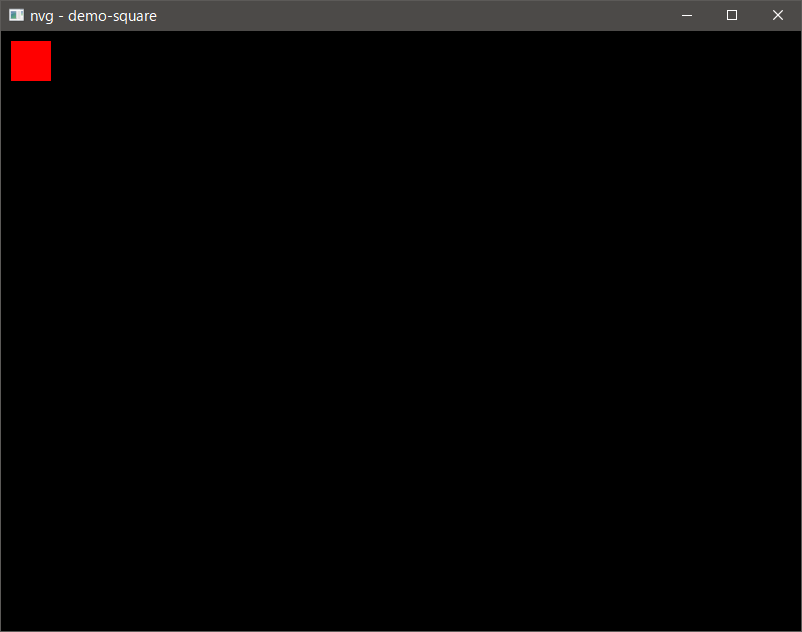
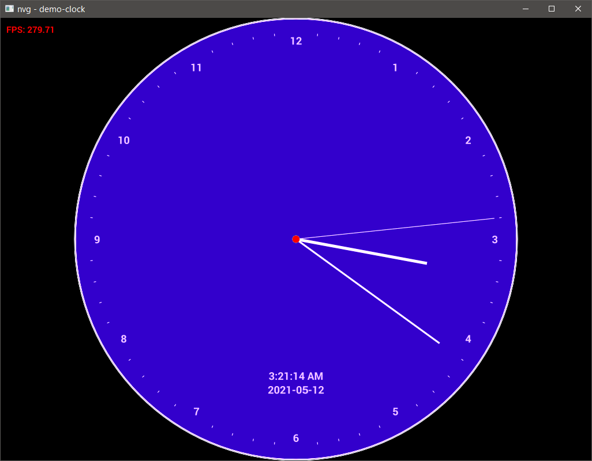
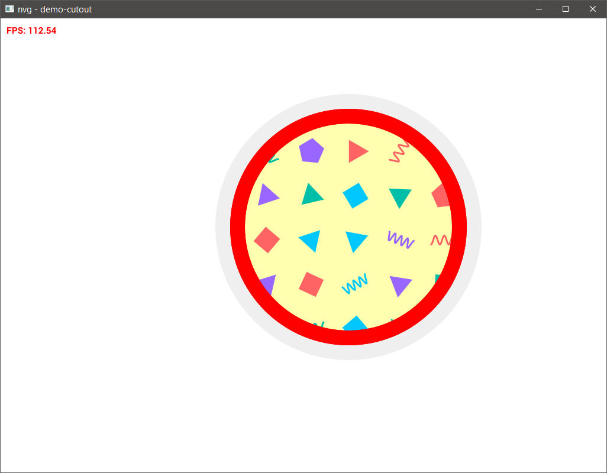
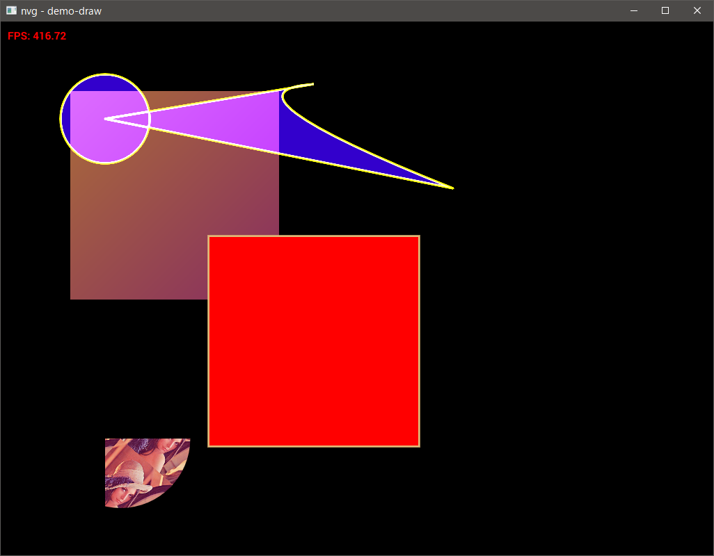
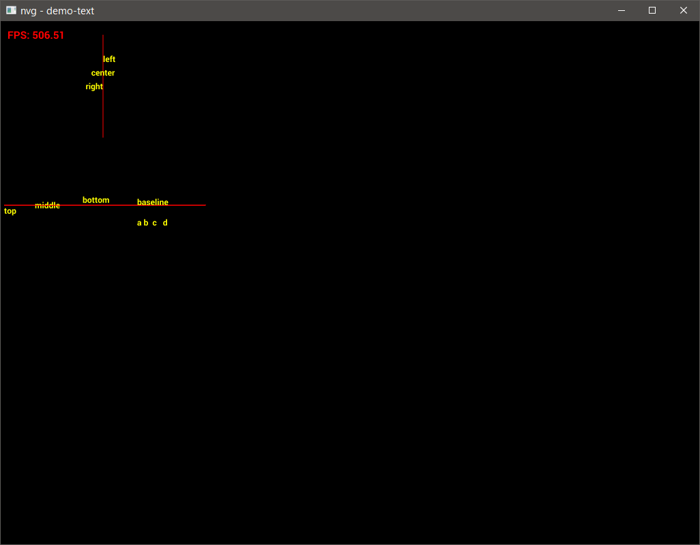

# Nvg fork OpenGL backend

## Demos

nvg_gl_backend examples, can help beginner to start with nvg.

### Simple square

```
run -p nvg_gl_backend --example demo-square
```

<figure>
  
  <figcaption>Draw square with nvg</figcaption>
</figure>

### Clock

```
run -p nvg_gl_backend --example demo-clock
```

<figure>
  
  <figcaption>Watch the clock with nvg</figcaption>
</figure>

### Cutout

```
run -p nvg_gl_backend --example demo-cutout
```

<figure>
  
  <figcaption>Cutout circle with nvg</figcaption>
</figure>

### Draw

```
run -p nvg_gl_backend --example demo-draw
```

<figure>
  
  <figcaption>Draw bezier curve and more with nvg</figcaption>
</figure>

### Text

```
run -p nvg_gl_backend --example demo-text
```

<figure>
  
  <figcaption>Draw text with nvg</figcaption>
</figure>
